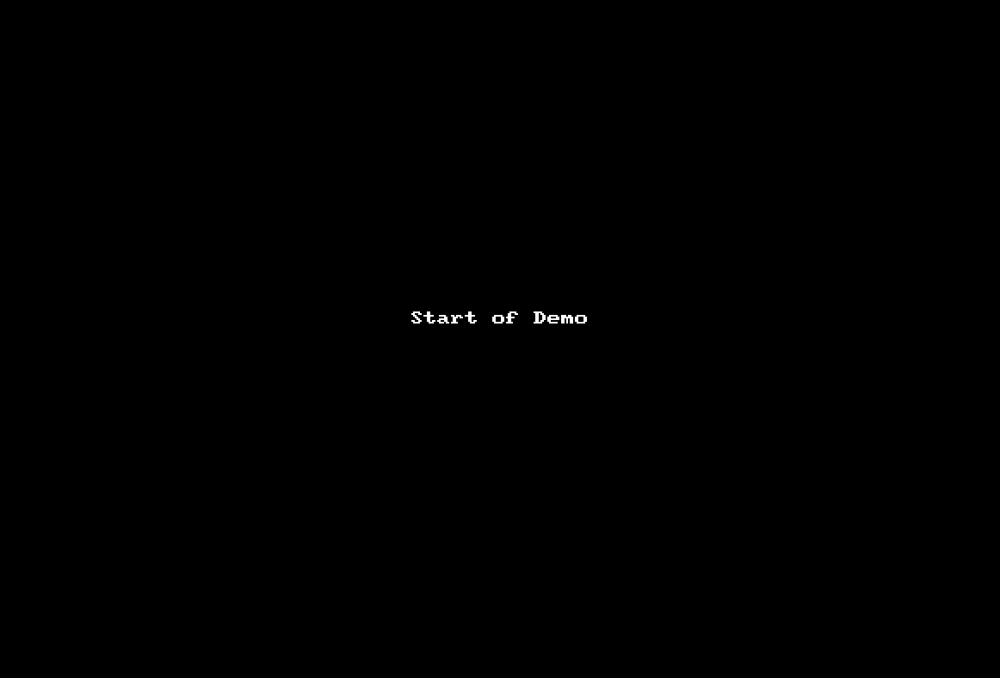

# Arcade Game Project
The purpose of the project is to understand the concepts of  object-oriented programming in Javascript.

## Table of Contents

- [Instructions](#instructions)
- [How to play](#how-to-play)
- [Demo](#demo)
- [Contributing](#contributing)

## Instructions
To clone this repository
```
git clone https://github.com/rajashekar/arcade-game.git
```

Go to arcade-game directory
```
cd arcade-game
```

Open `index.html` in any browser (drag and drop index.html in browser)

## How to play

- To win the game the player needs to get to water avoiding enemies.
- Use keyboard (left, up, right, down) keys - :arrow_left: :arrow_up: :arrow_right: :arrow_down: to move the player.
- If player gets hit by enemies :bug:, position will be reset to start position. 
- If player reaches the water, you won the game :thumbsup:

## Demo



## Contributing

This repository is done as part of Udacity Front end Web developer Arcade Game project. Therefore, we most likely will not accept pull requests.
